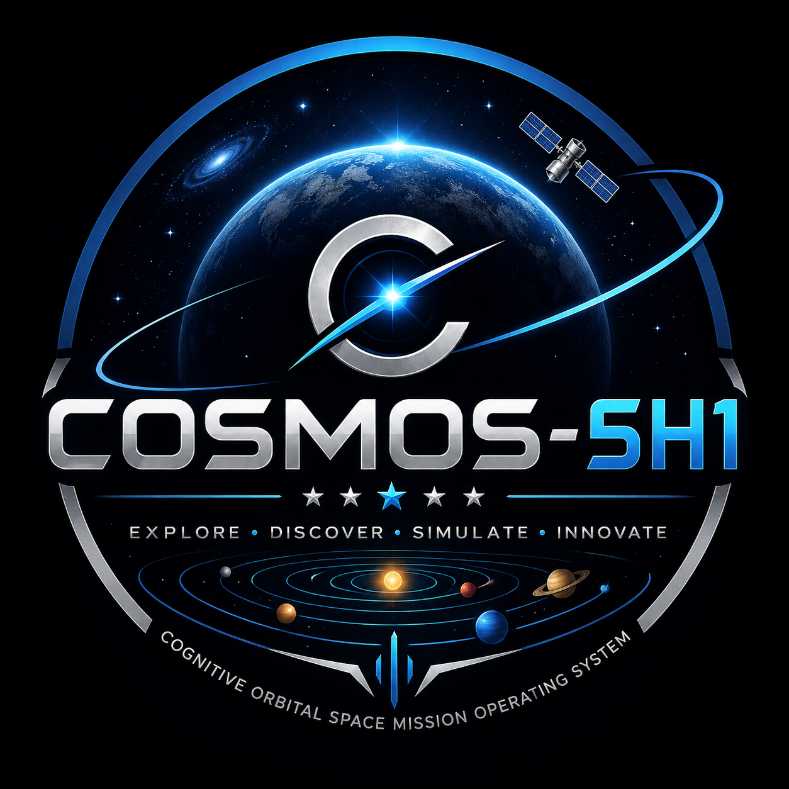

<div align="center">



<br/>


<br/>


<br/>

<p align="center">
  
  
  
  
  
  
  
</p>

<p align="center">
  <b>An AI-powered space exploration platform running IBM Granite 3.3 entirely locally via Ollama — no API keys needed.<br/>
  NASA APIs, Physics simulations, Morse Code communication, 3D visualization, and a 28-file knowledge base<br/>
  — built entirely with IBM Bob.</b>
</p>

<p align="center">
  <a href="https://github.com/Ninjaboy249/COSMOS-5H1">
    
  </a>
  &nbsp;
  <a href="https://github.com/Ninjaboy249/COSMOS-5H1/issues">
    
  </a>
  &nbsp;
  
</p>

</div>

---

## 🌌 Problem Statement

> *"Space is the final frontier — but most people have no accessible, intelligent gateway to explore it."*

The universe contains **billions of galaxies, trillions of stars, and infinite mysteries** — yet public access to space knowledge is scattered, disconnected, and passive. Existing tools are either:

- 📖 **Static wikis** — text-heavy with no interactivity
- 🌐 **API-dependent** — break without internet
- 🤖 **Cloud AI** — require subscriptions, send data to external servers
- 🔭 **Simulation tools** — complex, not beginner-friendly

**There is no single platform that combines:**
real-time NASA data + offline AI intelligence + 3D interactive exploration + physics simulations + historical communication protocols — all in one place, for everyone, for free, with full privacy.

---

## 💡 Solution — COSMOS-5H1

**COSMOS-5H1** (Cognitive Orbital Space Mission Operating System) is an AI-assisted space exploration application with a local knowledge engine and offline fallbacks. Live data and voice features require their respective network services.

<div align="center">

```
╔══════════════════════════════════════════════════════════════════╗
║                  COSMOS-5H1 Platform Overview                    ║
╠══════════════════════════════════════════════════════════════════╣
║  🌌 Cinematic Intro     →  Welcome video + space audio           ║
║  🪐 Solar System        →  CSS-animated orbiting planets         ║
║  🚀 Space Explorer      →  20 interactive modules                ║
║  🧠 COSMOS AI           →  Offline TF-IDF RAG · IBM Granite 3.3  ║
║  📡 NASA APIs           →  6 live feeds + offline cache          ║
║  🛰  ISS Tracker         →  Real-time position map               ║
║  📸 APOD                →  Daily astronomy photo                 ║
║  ☄  NEO Tracker         →  Near-Earth object monitor             ║
║  🎥 Mars Rover Gallery  →  Latest Perseverance photos            ║
║  🛸 Launch Tracker      →  Upcoming & recent launches (LL2)      ║
║  🚀 SpaceX Tracker      →  Missions + rockets (SpaceX API v4)    ║
║  🔭 Exoplanet Archive   →  NASA Exoplanet Archive TAP            ║
║  🪐 Cosmic Compare      →  AI-powered side-by-side comparison    ║
║  🛸 Mission Planner     →  Full AI mission design + risk matrix  ║
║  ⚛️  Physics & Mission Lab → 8 real-equation simulators          ║
║  📡 Morse Code Center   →  7-panel interactive communication hub ║
╚══════════════════════════════════════════════════════════════════╝
```

</div>

### Key Capabilities

| Feature | Description |
|---|---|
| 🧠 **COSMOS AI** | IBM Granite 3.3 runs locally via Ollama — no API keys, no cloud calls, full offline intelligence |
| 🪐 **Solar System** | Interactive CSS-animated solar system with clickable planets opening scientific detail modals |
| 🚀 **Space Explorer** | 20 premium glassmorphism cards navigating to full detail pages (stats, timeline, missions, gallery, AI chat) |
| 📡 **Live NASA Data** | APOD, Mars Rover Photos, NeoWs, DONKI Space Weather, EPIC Earth Imagery, ISS Position — all with offline fallback |
| 🛸 **Launch Tracker** | Upcoming & recent global launches via Launch Library 2 — with static fallback |
| 🚀 **SpaceX Tracker** | Recent launches, upcoming missions, rocket specs via SpaceX API v4 — with static fallback |
| 🔭 **Exoplanet Archive** | Habitable-zone & notable exoplanets from NASA Exoplanet Archive TAP — with static fallback |
| 🪐 **Cosmic Compare** | AI-powered side-by-side celestial body comparison with offline knowledge insights |
| 🛸 **Mission Planner** | Full mission design: launch windows, orbital mechanics, fuel/ΔV, crew, payload, cost, risk, timeline |
| ⚛️ **Physics Lab** | 8 real-equation simulators: Tsiolkovsky rocket, Kepler orbit, Schwarzschild black hole, asteroid impact and more |
| 📡 **Morse Code Center** | 7-panel hub: translator, Web Audio API player, Canvas visualizer, flashlight mode, keyboard practice, lessons, challenge mode, Space Comm Simulator |
| 🗺 **Navigation AI** | Say "Open Mars" or "Show Jupiter" — COSMOS AI navigates directly to the page |
| 🔍 **Global Search** | Ctrl+K semantic search across all 20 space modules |
| 🎙 **Voice Input** | Web Speech API voice questions to COSMOS AI |
| 💾 **Memory** | Conversation context, search history, and follow-up suggestions persist per session |
| 🔊 **Ambient Audio** | Looping background space music with Navbar mute toggle |
| 🎬 **Smart Intro** | Cinematic intro video plays only on fresh tab open — back-navigation skips it instantly |

---

## 🤖 AI Approach & Architecture

### IBM Granite 3.3 — 100% Local, Zero API Keys

COSMOS-5H1 runs IBM Granite 3.3 entirely on your machine via Ollama:

```
┌─────────────────────────────────────────────────────────────────┐
│                    COSMOS AI Architecture                        │
├─────────────────────────────────────────────────────────────────┤
│                                                                  │
│   User Question                                                  │
│        │                                                         │
│        ▼                                                         │
│   ┌─────────────┐     ┌──────────────────────┐                  │
│   │   Intent    │────▶│  TF-IDF Context       │                  │
│   │  Detector   │     │  Retriever (28 files) │                  │
│   └─────────────┘     └──────────┬───────────┘                  │
│                                  │                               │
│                                  ▼                               │
│              ┌───────────────────────────────────────┐          │
│              │  Local IBM Granite 3.3 backend         │          │
│              │  backend/main.py → Ollama → granite3.3 │          │
│              │  No API key · No cloud · No cost        │          │
│              └──────────────────┬────────────────────┘          │
│                                 │  backend unreachable?          │
│                                 ▼                                │
│              ┌───────────────────────────────────────┐          │
│              │  Offline TF-IDF RAG                    │          │
│              │  (zero external dependencies)          │          │
│              └───────────────────────────────────────┘          │
│                                 │                                │
│                                 ▼                                │
│        Streamed Answer + Follow-ups + Source badge               │
│        🔷 IBM Granite 3.3 · Local  OR  📡 Offline TF-IDF        │
│                                                                  │
└─────────────────────────────────────────────────────────────────┘
```

### Service Breakdown

| Service | File | Responsibility |
|---|---|---|
| **KnowledgeService** | `lib/cosmos-ai/knowledge-service.ts` | Loads 28 JSON files, builds TF-IDF corpus, retrieves context |
| **IntentService** | `lib/cosmos-ai/intent-service.ts` | Classifies 17 intents: planet, mission, navigation, comparison, greeting, space weather… |
| **ResponseGenerator** | `lib/cosmos-ai/response-generator.ts` | Converts retrieved docs → natural language: overviews, attribute cards, comparison tables |
| **ConversationMemory** | `lib/cosmos-ai/conversation-memory.ts` | Session-scoped memory: last entity context, search history, pronoun resolution |
| **AI Chat API** | `app/api/cosmos-ai/route.ts` | IBM Granite 3.3 (local) → offline TF-IDF RAG fallback |
| **Compare AI API** | `app/api/cosmos-ai/compare/` | Cosmic Compare — IBM Granite 3.3 local → offline fallback |
| **Mission Planner API** | `app/api/mission-planner/route.ts` | AI mission planning — IBM Granite 3.3 local → deterministic offline engine |

### Knowledge Base — 28 Scientific JSON Files

```
data/knowledge/
├── greetings.json          ← 10 greeting patterns
├── solar-system.json       ← System overview + FAQs
├── sun.json                ← Full stellar data
├── mercury.json ──────────┐
├── venus.json             │
├── earth.json             │  Each planet file contains:
├── moon.json              ├─ Name, type, diameter, mass,
├── mars.json              │  gravity, temperature, atmosphere,
├── jupiter.json           │  missions, interesting_facts,
├── saturn.json            │  10+ FAQs (question + answer)
├── uranus.json            │
├── neptune.json           │
├── pluto.json ────────────┘
├── asteroids.json          ← DART, Apophis, OSIRIS-REx
├── comets.json             ← Halley, Rosetta/67P
├── stars.json              ← Types, lifecycle, famous stars
├── galaxies.json           ← Milky Way, Andromeda, dark matter
├── black-holes.json        ← M87*, Sgr A*, Hawking radiation
├── nebulae.json            ← Orion, Pillars of Creation, JWST
├── spacecraft.json         ← Voyager, Hubble, JWST, Cassini
├── satellites.json         ← Sputnik, Starlink, ISS, GPS
├── nasa-missions.json      ← Apollo → Artemis timeline
├── isro-missions.json      ← Chandrayaan 3, Mangalyaan, Gaganyaan
├── esa-missions.json       ← Rosetta, JUICE, Euclid, Gaia
├── rockets.json            ← Saturn V, Falcon 9, SLS, Starship
├── astronauts.json         ← Gagarin, Armstrong, Chawla, Sharma
├── space-weather.json      ← Flares, CMEs, auroras, Carrington
├── dwarf-planets.json      ← Pluto, Eris, Ceres, Makemake
├── space-exploration.json  ← 24-event timeline 1957–2024
└── faq.json                ← 54 general space Q&As
```

### Live Data Integrations (with Offline Fallback)

#### NASA APIs (require `NASA_API_KEY` or fall back to `DEMO_KEY`)

| API | Module | Fallback |
|---|---|---|
| NASA APOD | `ApodWidget` | Bundled placeholder image + description |
| Mars Rover Photos | `MarsRoverWidget` | 3 sample Mars images |
| NeoWs (Near-Earth Objects) | `NeoWidget` | 3 example NEO entries |
| DONKI Space Weather | `SpaceWeatherWidget` | 2 sample solar events |
| NASA EPIC (Earth imagery) | `EpicWidget` | Earth planet image |
| Open Notify ISS | `IssWidget` | Default ISS position, refreshes every 10s |

#### Third-party APIs (free, no key required)

| API | Source | Module | Fallback |
|---|---|---|---|
| Upcoming & recent launches | Launch Library 2 (`ll.thespacedevs.com/2.2.0`) | `LaunchesWidget` | 2 static launches |
| SpaceX launches + rockets | SpaceX REST API v4 (`api.spacexdata.com/v4`) | `SpaceXWidget` | Falcon 9, Starship entries |
| Exoplanet catalogue | NASA Exoplanet Archive TAP (`exoplanetarchive.ipac.caltech.edu`) | `ExoplanetWidget` | 10 curated notable exoplanets |

---

## ⚛️ Physics & Mission Lab

8 real-equation interactive simulators built with pure Canvas 2D API — no external physics libraries:

| Simulator | Physics | Key Equation |
|---|---|---|
| 🚀 **Rocket Launch** | Tsiolkovsky rocket equation + atmospheric drag | Δv = Isp·g₀·ln(m₀/mf) |
| 🎯 **Projectile Motion** | Parabolic trajectory + drag | x = v₀cosθ·t, y = v₀sinθ·t − ½gt² |
| 🌍 **Gravity Comparison** | Multi-planet drop test | F = mg (g per planet) |
| 🪐 **Orbital Mechanics** | Kepler orbit + Hohmann transfer | v = √(GM/r) |
| 🔭 **Newton Gravity** | Inverse-square law with symplectic Euler integration | F = Gm₁m₂/r² |
| ⚡ **Escape Velocity** | Energy classifier + speed gauge | v_e = √(2GM/r) |
| 🕳 **Black Hole** | Schwarzschild spacetime grid + lensing | r_s = 2GM/c² |
| ☄ **Asteroid Impact** | Melosh crater scaling + 4-phase animation | D ∝ E^0.294 |

---

## 📡 Morse Code Communication Center

A full 7-panel interactive hub teaching International Morse Code (ITU-R M.1677-1):

```
Precise timing — all implemented from scratch:
  Dot  = 1 unit   |  Dash         = 3 units
  Sym-gap = 1 unit |  Letter-gap   = 3 units
  Word-gap = 7 units
  PARIS standard: 50 units/word → WPM = 60000 / (50 × WPM_target) ms per unit
```

| Panel | Description |
|---|---|
| **⟷ Translator** | Bidirectional text↔Morse; copy, download, share; 56-char reference grid |
| **🔊 Audio Player** | Web Audio API · 600 Hz CW tone · attack/decay envelope · WPM 5–40 · volume · play/pause/stop/replay |
| **📺 Visualizer** | Canvas pulse track with scrolling scan cursor + live waveform · always visible |
| **🔦 Flashlight** | LED bulb, screen flash, beacon with pulsing rings · brightness + speed controls |
| **⌨️ Practice** | Spacebar/mouse/touch input · auto-calibrated dot timing · accuracy, streak, history |
| **📚 Lessons** | 6 progressive lessons (History → ITU Standard → SOS → Space Comms → Emergency → Amateur Radio) · lock/unlock system |
| **⚔️ Challenge** | Decode-before-time-runs-out · countdown + streak bonuses · 4 difficulties · high score tracking |
| **🛸 Space Sim** | Canvas-animated spacecraft + ground station · radio wave propagation · 5 mission scenarios · comm delay simulation |

---

## 🛸 Mission Planner

AI-powered mission design tool that computes a complete space mission plan:

- **Launch Windows** — optimal + backup dates with orbital reasoning
- **Orbit Profile** — type, altitude, inclination, period
- **Spacecraft** — name, type, technical description
- **Propulsion & Fuel** — total propellant, ΔV budget, staging
- **Crew** — size, roles, training requirements
- **Payload** — primary/secondary instruments, total mass
- **Cost Estimate** — USD breakdown by category
- **Risk Assessment** — 0–10 score + factors + mitigations (animated gauge)
- **Mission Timeline** — phase-by-phase with pulsing animated dots
- **Backup & Contingencies** — abort procedures

Destinations: Moon, Mars, Venus, Mercury, Jupiter, Saturn, Europa

---

## 🎯 Selected Challenge Theme

<div align="center">

```
┌───────────────────────────────────────────────────────┐
│                                                       │
│   Challenge:   August Challenge                       │
│                                                       │
│   Theme:       Advance Space Exploration with AI      │
│                                                       │
│   Mission:  Make space knowledge accessible to        │
│             everyone, everywhere, offline, free.      │
│                                                       │
└───────────────────────────────────────────────────────┘
```

</div>

COSMOS-5H1 addresses the **Advance Space Exploration with AI** theme by:

- 🌍 **Universal Access** — Works completely offline; no subscription, no internet dependency after load
- 📚 **Depth over Simplicity** — 28 curated knowledge files with 100+ FAQs per celestial body
- 🧠 **Intelligent Guidance** — COSMOS AI detects what the user wants and responds naturally; IBM Granite 3.3 runs entirely on-device
- 🚀 **Inspiring Curiosity** — Cinematic intro, animated solar system, physics lab, Morse code communication
- 🔬 **Scientific Accuracy** — All data sourced from NASA, ESA, and peer-reviewed sources; real equations throughout
- 🛰 **Real-World Data** — Live NASA API feeds ground the experience in current science
- 📡 **Historical Communication** — Morse Code module teaches ITU-R M.1677-1 standard used in aviation, maritime, and space

---

## 🛠 How IBM Bob Was Used

> IBM Bob was the **sole development environment** for COSMOS-5H1 — every line of code, every architecture decision, and every file was created through Bob's agent.

### The Full Development Journey with Bob

```
Phase 1 — Foundation
  Bob → Read Next.js 16 docs in node_modules/next/dist/docs/
  Bob → Audited project structure, tsconfig, package.json
  Bob → Built Navbar with scroll behavior + music toggle
  Bob → Wired section refs for smooth navigation

Phase 2 — Space Explorer & NASA APIs
  Bob → Created Space Explorer dashboard (20 glassmorphism cards)
  Bob → Built /space/[slug] dynamic detail pages
  Bob → Implemented all 6 NASA API widgets with offline fallback
  Bob → Created global search (Ctrl+K) with fuzzy matching

Phase 3 — COSMOS AI System
  Bob → Designed full offline RAG architecture
  Bob → Generated all 28 JSON knowledge base files
  Bob → Built TF-IDF engine from scratch (zero external deps)
  Bob → Created IntentService (17 intents), ConversationMemory,
         ResponseGenerator with markdown output
  Bob → Upgraded AIAssistant: streaming text, voice input,
         history tab, follow-up suggestions, navigation commands
  Bob → Wired IBM Granite 3.3 (local) as primary with TF-IDF fallback
  Bob → Built Cosmic Compare AI endpoint with online/offline badge

Phase 4 — Mission Planner & Physics Lab
  Bob → AI Mission Planner: launch windows, ΔV, fuel, crew, cost,
         risk gauge, animated timeline, typewriter summary
  Bob → Physics Lab: 8 simulators using real equations + Canvas 2D:
         Tsiolkovsky, Kepler, Schwarzschild, Melosh crater scaling
  Bob → All simulators: zero external physics libraries

Phase 5 — Morse Code Communication Center
  Bob → lib/morse-code.ts: full ITU-R M.1677-1 engine (56 chars)
  Bob → MorseAudioPlayer: Web Audio API 600 Hz CW with precise timing
  Bob → MorseVisualizer: Canvas pulse track + scrolling scan cursor
  Bob → FlashlightMode: LED / screen flash / beacon animations
  Bob → KeyboardPractice: spacebar timing + auto-calibration
  Bob → MorseLessons: 6 progressive lessons with lock/unlock system
  Bob → ChallengeMode: timed decode mini-games, 4 difficulties
  Bob → SpaceCommSim: animated spacecraft + radio wave canvas

Phase 6 — Polish & Bug Fixes
  Bob → Smart intro: sessionStorage flag set immediately on mount —
         back-navigation from any route skips video entirely
  Bob → Mission Planner text: all opacity < 70% eliminated;
         shimmer animations on card headers; animated timeline dots
  Bob → Navbar + homepage: added Morse Code entry points
  Bob → TypeScript zero-error validation on every change
  Bob → Committed and pushed all changes to GitHub

Phase 7 — Live Data Labels & Voice Bug Fix
  Bob → Diagnosed stale closure bug in useVoiceRecognition.ts:
         onend captured `state` at call time (always "idle"),
         so setState("idle") never fired → mic stuck after each session
  Bob → Fixed with functional setState updater: setState(prev => ...)
  Bob → Corrected source labels on 3 non-NASA live widgets:
         LaunchesWidget  → "Launch Library 2"
         SpaceXWidget    → "SpaceX API v4"
         ExoplanetWidget → "NASA Exoplanet Archive"
  Bob → Documented all 3 third-party APIs in README

Phase 8 — Streaming Fix & Cleanup
  Bob → Fixed StreamingText restart-on-keypress bug in AIAssistant:
         onDone inline arrow caused useEffect dep change every keystroke
         → solved with onDoneRef pattern (effect only deps on [text])
  Bob → Removed all OpenAI references — COSMOS AI runs fully offline
         via IBM Granite 3.3 (local) with TF-IDF RAG fallback
  Bob → Fixed Newton Gravity simulator: wrong integration (double-dt),
         animation loop restarting on slider change, stale drawScene
         closure, explosion afterburn restarting, canvas sizing
  Bob → TypeScript zero-error validated, committed, pushed to GitHub
```

### Bob Capabilities Used

| Bob Feature | How It Was Used |
|---|---|
| **Agent Mode** | Full autonomous multi-file implementation across every phase |
| **`spawn_subagent`** | Generated 15 knowledge base JSON files in parallel (3 subagents × 5 files each) |
| **`write_file`** | Created 60+ new source files from scratch |
| **`apply_diff`** | Surgical edits to existing files without touching surrounding code |
| **`execute_command`** | `npx tsc --noEmit` after every change to catch type errors immediately |
| **`grep` / `glob`** | Explored codebase before editing to avoid conflicts |
| **`update_todo_list`** | Tracked 60+ tasks across 8 major development phases |
| **`GetSymbolsOverview`** | Understood component structures before modifying them |
| **`insert_content`** | Appended large CSS blocks to globals.css without overwrite |
| **`gh` CLI via Bob** | Created GitHub repo and pushed all files |
| **`read_file`** | Always read files before editing — never speculated about code |

### Lines Written by Bob

```
Source code (TypeScript/TSX)  →  ~11,000 lines
CSS (globals.css additions)   →   ~2,900 lines
JSON knowledge base files     →   ~4,800 lines
Configuration & types         →     ~300 lines
─────────────────────────────────────────────────
Total                         →  ~19,000 lines
```

---

## 🚀 Quick Start

```bash
# Clone
git clone https://github.com/Ninjaboy249/COSMOS-5H1.git
cd COSMOS-5H1

# Install
npm install

# Run
npm run dev
```

Open **[http://localhost:3000](http://localhost:3000)** — no API keys needed, works fully offline.

### IBM Granite 3.3 — runs locally, no API key

```bash
# 1 · Install Ollama → https://ollama.ai
ollama pull granite3.3:2b

# 2 · Start the Python backend
cd backend
pip install -r requirements.txt
python main.py
# → http://localhost:8000
```

That's it. The Next.js app connects to `http://localhost:8000` automatically. The chat panel shows **🔷 IBM Granite 3.3 · Local** when the backend is running.

If the backend is not running, every AI call falls back silently to the **offline TF-IDF RAG engine** — 28 knowledge files, zero external calls, still fully functional.

---

## 🗂 Project Structure

```
COSMOS-5H1/
├── app/
│   ├── page.tsx                    # Main page (intro + solar system + hero)
│   ├── layout.tsx                  # Root layout
│   ├── globals.css                 # All styles (2,900+ lines, .se-/.cc-/.pl-/.mc-*)
│   ├── space/
│   │   ├── page.tsx                # Space Explorer dashboard (20 cards)
│   │   └── [slug]/SpaceDetailClient  # Full detail page (7 tabs)
│   ├── compare/page.tsx            # Cosmic Compare module
│   ├── mission-planner/page.tsx    # AI Mission Planner
│   ├── physics-lab/page.tsx        # Physics & Mission Lab (8 simulators)
│   ├── morse-code/page.tsx         # Morse Code Communication Center (7 panels)
│   └── api/
│       ├── cosmos-ai/route.ts      # AI chat (IBM Granite 3.3 → TF-IDF fallback)
│       ├── cosmos-ai/compare/      # Cosmic Compare AI endpoint
│       └── mission-planner/        # Mission plan generator
│
├── components/
│   ├── layout/Navbar.tsx           # Navigation + music + logo + all route links
│   └── ui/                         # Carousel, bento grid, button, ascii-glitch
│
├── features/
│   ├── ai-assistant/AIAssistant    # Floating COSMOS AI chat panel
│   ├── cosmic-compare/             # Compare UI + AI insights panel
│   ├── hero/                       # Hero text + CSS solar system
│   ├── loading/                    # Welcome video + loading screen
│   ├── solar-system/               # Planet carousel + modals
│   ├── space-explorer/             # 20 widget components + NASA API widgets
│   ├── physics-lab/                # 8 physics simulators (Canvas 2D)
│   └── morse-code/                 # 8 Morse components (audio + canvas + UI)
│
├── lib/
│   ├── cosmos-ai/
│   │   ├── knowledge-service.ts    # TF-IDF engine + corpus builder
│   │   ├── intent-service.ts       # 17-class intent detector
│   │   ├── response-generator.ts   # RAG answer builder
│   │   └── conversation-memory.ts  # Session memory + suggestions
│   ├── morse-code.ts               # ITU-R M.1677-1 engine (encode/decode/timing)
│   ├── nasa-api.ts                 # 6 NASA APIs + offline fallbacks
│   ├── space-explorer-data.ts      # 20 category + detail data
│   └── celestial-data.ts           # Planet stats for modals
│
├── data/knowledge/                 # 28 scientific JSON files
├── types/index.ts                  # TypeScript interfaces
├── public/
│   ├── images/                     # Planet images + COSMOS logo
│   ├── audio/space.mp3             # Background music
│   └── video/space-welcome.mp4     # Intro video
└── backend/
    ├── main.py                     # FastAPI + LangChain + ChromaDB
    └── requirements.txt
```

---

## 🧰 Tech Stack

<div align="center">

| Layer | Technology |
|---|---|
| **Framework** | Next.js 16.2 (App Router, dynamic imports, SSR-safe) |
| **UI** | React 19, TypeScript 5 |
| **Styling** | Tailwind CSS v4, Glassmorphism, Custom CSS (`.se-` `.cc-` `.pl-` `.mc-`) |
| **Animation** | Framer Motion 12, GSAP 3 |
| **3D** | React Three Fiber, Drei, Three.js |
| **AI Engine** | Custom TF-IDF + RAG pipeline (zero external deps) |
| **AI Model** | IBM Granite 3.3 via local Ollama (`backend/main.py`) — no API key |
| **AI Fallback** | Offline TF-IDF RAG — works without backend running |
| **AI Backend** | FastAPI + LangChain + ChromaDB + IBM Granite 3.3 (Ollama) |
| **Physics** | Canvas 2D API + real equations (Tsiolkovsky, Kepler, Schwarzschild, Melosh) |
| **Audio** | Web Audio API (Morse CW tones, 600 Hz, attack/decay envelope) |
| **Communication** | ITU-R M.1677-1 Morse Code engine (encode / decode / timing / symbols) |
| **APIs** | NASA (APOD, Mars Rover, NeoWs, DONKI, EPIC, ISS) · Launch Library 2 · SpaceX API v4 · NASA Exoplanet Archive |
| **Voice** | Web Speech API |
| **Icons** | Lucide React, Phosphor Icons |
| **Dev Tool** | IBM Bob (100% of code written via agent) |

</div>

---

## 📸 Feature Highlights

<div align="center">

| 🌌 Cinematic Intro | 🪐 Solar System | 🚀 Space Explorer |
|---|---|---|
| Smart video — plays only on fresh tab, skips on back | CSS-animated orbiting planets | 20 glassmorphism module cards |

| 🧠 COSMOS AI | 🪐 Cosmic Compare | 🛸 Mission Planner |
|---|---|---|
| IBM Granite 3.3 local + offline TF-IDF fallback | AI side-by-side comparison with online/offline badge | Full mission design with animated risk gauge |

| ⚛️ Physics Lab | 📡 Morse Code | 🌐 Live Data |
|---|---|---|
| 8 real-equation Canvas simulators | 7-panel hub: audio, flash, practice, challenge, space sim | NASA + Launch Library 2 + SpaceX API + Exoplanet Archive |

</div>

---

## 🔑 Environment Variables (Optional)

```env
# .env.local  (all optional — the app works with zero keys)

# IBM Granite local backend URL (default: http://localhost:8000)
NEXT_PUBLIC_BACKEND_URL=http://localhost:8000

# Higher NASA API rate limits (DEMO_KEY works for demos)
NASA_API_KEY=your_key_here
```

No API keys are required. Start Ollama + `python main.py` and the full IBM Granite AI is live.

---

<div align="center">

**Built with ❤️ and IBM Bob — Explore · Discover · Simulate · Communicate · Innovate**


<sub>COSMOS-5H1 · Cognitive Orbital Space Mission Operating System · MIT License</sub>

</div>
